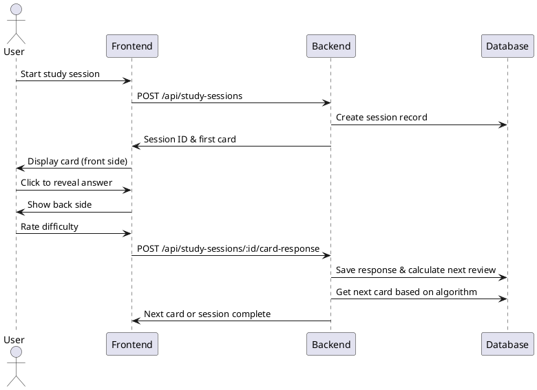
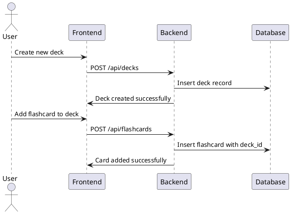

# Kế hoạch Quản lý bộ Flashcard - REVISED

## Tóm tắt mục tiêu
Phát triển thêm các tính năng còn thiếu cho **flashcard-service** hiện tại trong hệ thống Spaced Repetition modular monolith, tập trung vào những chức năng cần thiết và khả thi cho phase hiện tại.

## 📋 Phân tích hiện trạng (Current State Analysis)

### ✅ Đã có sẵn (Existing Infrastructure)
- **Modular Architecture**: 7 services độc lập (auth, user, flashcard, review, reminder, core, main)
- **Database**: MySQL với JPA/Hibernate
- **Authentication**: Account/User system đã hoàn thiện
- **Core Services**: Exception handling, Email service với i18n
- **Basic Entities**: Deck, Flashcard, ReviewLog, User đã được định nghĩa
- **Enums**: FlashcardStatus (NEW, LEARNING, REVIEW, MASTERED), ReviewResult

### 🔧 Flashcard Service hiện tại có:
- **Entities**: Deck (title, description, ownerId), Flashcard (front, back, deckId, status)
- **Controllers**: DeckController, FlashcardController (skeleton)
- **Services & Repositories**: Đã setup cơ bản

### ⚠️ Cần bổ sung (Missing Components)
- Service implementation logic
- API endpoints chi tiết
- Study session functionality
- Progress tracking integration
- Security & authorization

---

## 1. Phân tích Actors và User Stories

### 1.1 Actors (Các tác nhân)
- **Student (Học sinh)**: Người học chính sử dụng flashcard
- **Teacher (Giáo viên)**: Người tạo và quản lý nội dung học tập
- **Admin (Quản trị viên)**: Quản lý hệ thống và người dùng
- **Guest (Khách)**: Người dùng chưa đăng ký, chỉ xem nội dung công khai

### 1.2 User Stories - Phase 1 (Realistic & Focused)

#### Epic 1: Hoàn thiện Flashcard CRUD
**US1.1: Implement Flashcard Service Logic**
- **Là** Developer
- **Tôi muốn** hoàn thiện logic cho FlashcardService
- **Để** có thể tạo, đọc, cập nhật, xóa flashcard

**Acceptance Criteria:**
- [ ] Implement tất cả methods trong FlashcardService
- [ ] Validation: front và back không được trống
- [ ] Chỉ owner deck mới được tạo/sửa/xóa flashcard
- [ ] Sử dụng existing FlashcardStatus enum

**US1.2: Complete Deck Management**
- **Là** User (authenticated)  
- **Tôi muốn** quản lý các deck của mình
- **Để** tổ chức flashcard theo chủ đề

**Acceptance Criteria:**
- [ ] Implement DeckService với CRUD operations
- [ ] User chỉ xem được deck của mình
- [ ] Validation: title không trống, maxlength 255
- [ ] Soft delete cho deck (giữ lại data)

#### Epic 2: Basic Study Session
**US2.1: Simple Study Mode**
- **Là** User
- **Tôi muốn** học flashcard theo deck
- **Để** ghi nhớ nội dung

**Acceptance Criteria:**
- [ ] API để lấy flashcard theo deck
- [ ] Tích hợp với ReviewLog service có sẵn
- [ ] Cập nhật FlashcardStatus khi học
- [ ] Không cần UI phức tạp (API first)

#### Epic 3: Integration & Security  
**US3.1: Service Integration**
- **Là** System
- **Tôi muốn** tích hợp flashcard với review service
- **Để** tracking progress

**Acceptance Criteria:**
- [ ] Kết nối với ReviewLog khi user study
- [ ] Sử dụng existing User authentication
- [ ] Error handling với Core Exception
- [ ] API documentation cơ bản

---

## 2. Luồng nghiệp vụ chính

### 2.1 Luồng tạo và học flashcard
```
1. User đăng nhập
2. Tạo deck mới hoặc chọn deck có sẵn
3. Thêm flashcard vào deck
4. Bắt đầu session học tập
5. Hệ thống hiển thị thẻ theo thuật toán
6. User đánh giá độ khó
7. Cập nhật lịch ôn tập
8. Lưu tiến độ học tập
```

### 2.2 Luồng ngoại lệ
- **Mất kết nối**: Lưu dữ liệu tạm thời trong localStorage
- **Deck trống**: Hiển thị hướng dẫn tạo thẻ đầu tiên
- **Permission denied**: Redirect về trang public hoặc login

---

## 3. Ràng buộc nghiệp vụ

### 3.1 Ràng buộc dữ liệu
- Flashcard: câu hỏi và đáp án không được trống
- Deck: tên deck tối đa 100 ký tự
- User: chỉ được tạo tối đa 50 deck (miễn phí)

### 3.2 Ràng buộc bảo mật
- Chỉ owner được chỉnh sửa/xóa deck
- Public deck: mọi người xem được, chỉ owner chỉnh sửa
- Private deck: chỉ owner và được chia sẻ

---

## 4. Chức năng cần implement (Dựa trên existing structure)

### 4.1 Phase 1 - Core Implementation (Ưu tiên cao)

#### F1: Complete FlashcardService ✅ **REUSE existing**
**Mô tả:** Implement logic cho service đã có skeleton
**Existing:** FlashcardService, FlashcardRepository, FlashcardController

**API Endpoints cần implement:**
```java
// FlashcardController - cần implement methods
POST /api/flashcards                    // Create new flashcard
GET /api/flashcards/{id}               // Get flashcard by ID  
PUT /api/flashcards/{id}               // Update flashcard
DELETE /api/flashcards/{id}            // Delete flashcard
GET /api/decks/{deckId}/flashcards     // Get all flashcards in deck
```

**Service Methods cần viết:**
```java
// FlashcardService implementation
public FlashcardDto createFlashcard(CreateFlashcardRequest request);
public FlashcardDto getFlashcardById(String id);
public FlashcardDto updateFlashcard(String id, UpdateFlashcardRequest request);
public void deleteFlashcard(String id);
public List<FlashcardDto> getFlashcardsByDeck(String deckId);
```

#### F2: Complete DeckService ✅ **REUSE existing** 
**Mô tả:** Implement logic cho DeckService
**Existing:** DeckService, DeckRepository, DeckController

**API Endpoints:**
```java
// DeckController - implement methods
POST /api/decks                        // Create deck
GET /api/decks                         // Get user's decks (paginated)
GET /api/decks/{id}                    // Get deck details
PUT /api/decks/{id}                    // Update deck
DELETE /api/decks/{id}                 // Soft delete deck
```

#### F3: Study Session Integration ✅ **USE existing ReviewLog**
**Mô tả:** Tích hợp với review-service có sẵn
**Existing:** ReviewLog entity, ReviewLogService

**New Endpoints trong FlashcardController:**
```java
GET /api/decks/{deckId}/study          // Get flashcards for study
POST /api/decks/{deckId}/study-result  // Submit study result
```

**Integration với ReviewService:**
- Sử dụng existing ReviewLog(userId, flashcardId, result, reactionTimeMs, nextReviewDate)
- Cập nhật FlashcardStatus dựa trên ReviewResult
- Không cần tạo StudySession entity mới

#### F4: Authorization & Validation ✅ **USE existing Core**
**Mô tả:** Security và validation
**Existing:** Core Exception, User authentication

**Implementation:**
- Sử dụng SecurityConfig có sẵn
- Owner-based authorization cho Deck/Flashcard
- Validation với Bean Validation
- Error handling với CoreException

### 4.2 Phase 2 - Enhancements (Future)

#### F5: Study Algorithms
- Spaced repetition với existing ReviewLog
- Study statistics

#### F6: Advanced Features  
- Deck sharing (thêm isPublic vào Deck)
- File upload cho media flashcards

---

## 4.3 Existing Database Schema (KHÔNG THAY ĐỔI)

```sql
-- ✅ Đã có sẵn, không cần tạo mới
Decks {
  id: VARCHAR(36) PK              -- UUID from BaseEntity
  title: VARCHAR(255) NOT NULL
  description: TEXT
  owner_id: VARCHAR(36) NOT NULL  -- Reference to User.id
  created_at: TIMESTAMP           -- From BaseEntity
  updated_at: TIMESTAMP           -- From BaseEntity
}

Flashcards {
  id: VARCHAR(36) PK              -- UUID from BaseEntity  
  front: TEXT NOT NULL
  back: TEXT NOT NULL
  deck_id: VARCHAR(36) NOT NULL   -- FK to Decks
  status: ENUM('NEW','LEARNING','REVIEW','MASTERED')
  created_at: TIMESTAMP           -- From BaseEntity
  updated_at: TIMESTAMP           -- From BaseEntity
}

ReviewLogs {                      -- ✅ Đã có trong review-service
  id: VARCHAR(36) PK
  user_id: VARCHAR(36) NOT NULL
  flashcard_id: VARCHAR(36) NOT NULL
  result: ENUM ReviewResult       
  reaction_time_ms: INTEGER
  silent_mode: BOOLEAN
  next_review_date: DATETIME
  created_at: TIMESTAMP
}
```

---

## 5. Backlog ưu tiên - REVISED (Dựa trên existing code)

### 🚀 Sprint 1 - Core Implementation (1 week)
**T-shirt size: M** (Nhẹ hơn vì đã có infrastructure)
- [ ] **F1**: Complete FlashcardService methods - **S** (chỉ implement logic)
- [ ] **F2**: Complete DeckService methods - **S** (chỉ implement logic)  
- [ ] **F4**: Add validation & authorization - **S** (sử dụng existing core)
- [ ] Basic integration testing - **S**

### 🎯 Sprint 2 - Study Features (1 week)
**T-shirt size: S** (Sử dụng existing ReviewService)
- [ ] **F3**: Study endpoints integration - **M**
- [ ] FlashcardStatus update logic - **S**
- [ ] API documentation (Swagger) - **S**
- [ ] Error handling polish - **XS**

### ✨ Sprint 3+ - Future Enhancements (Optional)
- [ ] **F5**: Study statistics và analytics
- [ ] **F6**: Deck sharing (thêm isPublic field)
- [ ] Media upload support
- [ ] Performance optimization

---

## 6. Implementation Strategy (Step-by-step)

### 📝 Task Breakdown - Sprint 1

#### Week 1.1: FlashcardService Implementation
1. **Tạo DTOs cần thiết** (1 day)
   - CreateFlashcardRequest/Response
   - UpdateFlashcardRequest  
   - FlashcardDto

2. **Implement FlashcardService methods** (2 days)
   - Sử dụng existing FlashcardRepository
   - Add validation logic
   - Owner authorization

3. **Complete FlashcardController** (1 day)
   - Implement REST endpoints
   - Error handling với CoreException

#### Week 1.2: DeckService Implementation  
4. **Tạo Deck DTOs** (0.5 day)
   - CreateDeckRequest/Response
   - UpdateDeckRequest
   - DeckDto với flashcard count

5. **Implement DeckService** (1.5 days)
   - CRUD operations
   - Owner-based filtering
   - Soft delete logic

### 📝 Task Breakdown - Sprint 2

6. **Study Integration** (2 days)
   - Study endpoints trong FlashcardController
   - Tích hợp với existing ReviewLogService
   - FlashcardStatus transition logic

7. **Testing & Documentation** (3 days)
   - Unit tests cho services
   - Integration tests
   - API documentation

---

## 6. Thiết kế sơ bộ - Sequence Diagrams

### 6.1 Study Session Flow


### 6.2 Deck Creation Flow


---

## 7. Step-back Review - REVISED

### 7.1 Đánh giá lại dựa trên existing codebase ✅

#### ✅ Điểm mạnh của approach mới:
1. **Tận dụng infrastructure có sẵn**: Không cần tạo từ đầu
2. **Modular architecture**: Dễ maintain và extend
3. **Consistent với existing code**: Follow established patterns  
4. **Realistic timeline**: 2 weeks thay vì 4-5 weeks
5. **Low risk**: Build on proven foundation

#### ⚠️ Potential risks (đã giảm thiểu):
1. **Integration complexity**: GIẢM (sử dụng existing services)  
2. **Learning curve**: GIẢM (team đã quen với codebase)
3. **Scope creep**: KIỂM SOÁT (chỉ implement cần thiết)

### 7.2 Revised Recommendations

#### 🎯 Focus Phase 1 (2 weeks):
- **Chỉ** implement service logic, không tạo mới entities
- **Tận dụng** existing ReviewLog thay vì tạo StudySession mới
- **Sử dụng** existing Core Exception và Authentication
- **Bỏ qua** advanced features (spaced repetition algorithm, UI/UX)

#### 💡 Quick wins có thể thêm:
- [ ] **Swagger documentation** (auto-generated)
- [ ] **Health check endpoints** 
- [ ] **Basic pagination** (đã có PageResponse)
- [ ] **Soft delete** cho Deck (thêm deleted_at field)

### 7.3 Final Implementation Plan

#### ✅ Week 1 - Core Services (5 days)
```
Day 1: FlashcardService + DTOs
Day 2: FlashcardController + validation  
Day 3: DeckService + DTOs
Day 4: DeckController + authorization
Day 5: Testing + bug fixes
```

#### ✅ Week 2 - Study Integration (5 days)  
```
Day 1-2: Study endpoints + ReviewLog integration
Day 3: FlashcardStatus update logic
Day 4: Integration testing
Day 5: Documentation + deployment prep
```

---

## 8. Success Metrics - REVISED

### 📊 Technical Success (Phase 1):
- [ ] **All API endpoints working**: 100% coverage
- [ ] **Integration tests pass**: >95% success rate  
- [ ] **Response time**: <200ms average
- [ ] **Error handling**: Proper exception responses

### 📈 Business Success (Phase 1):
- [ ] **API functional**: Ready for frontend integration
- [ ] **Data consistency**: No orphaned records
- [ ] **Security**: Owner-based access control works
- [ ] **Maintainable**: Code follows existing patterns

### 🚀 Future Growth Enablers:
- Clean API design cho mobile app
- Extensible service architecture
- Performance foundation cho scaling

---

*📝 Document được tạo bởi Claude Code với phương pháp Chain-of-thought và Step-back review*
*🔄 Version 1.0 - Ngày tạo: 2025-08-12*